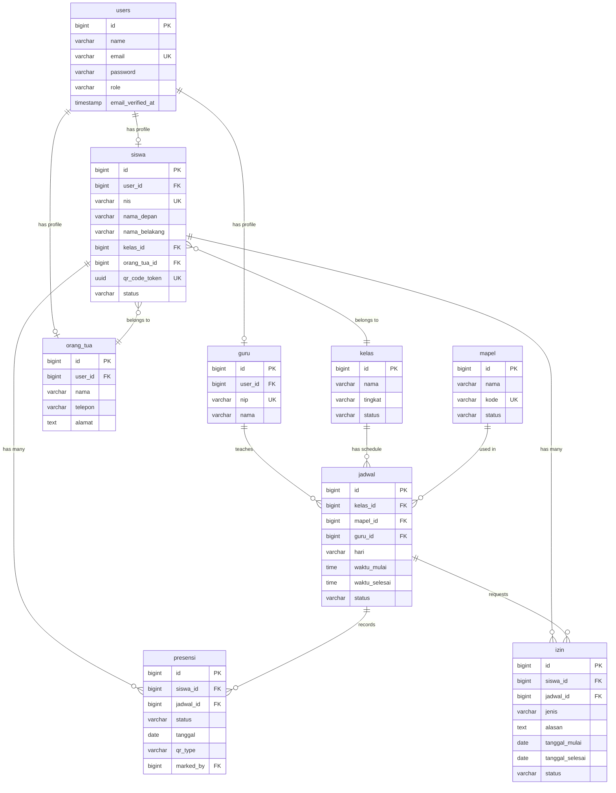

# Data Model - SiswaPresensi

> **Database:** PostgreSQL 14+
> **ORM:** Eloquent (Laravel 12)
> **Testing DB:** SQLite in-memory (`:memory:`)

---

## Database Schema

### Users Table

```sql
CREATE TABLE users (
    id BIGSERIAL PRIMARY KEY,
    name VARCHAR(255) NOT NULL,
    email VARCHAR(255) UNIQUE NOT NULL,
    email_verified_at TIMESTAMP NULL,
    password VARCHAR(255) NOT NULL,
    role VARCHAR(20) NOT NULL CHECK (role IN ('admin', 'guru', 'siswa', 'orang_tua')),
    two_factor_secret TEXT NULL,
    two_factor_recovery_codes TEXT NULL,
    two_factor_confirmed_at TIMESTAMP NULL,
    remember_token VARCHAR(100) NULL,
    created_at TIMESTAMP DEFAULT CURRENT_TIMESTAMP,
    updated_at TIMESTAMP DEFAULT CURRENT_TIMESTAMP
);

CREATE INDEX idx_users_role ON users (role);
```

> **Catatan:** Kolom `two_factor_*` disediakan oleh Laravel Fortify untuk fitur 2FA.
> Kolom `name` digunakan oleh Fortify sebagai display name. Role menentukan akses, sedangkan
> data profil spesifik (NIS, NIP, dll.) disimpan di tabel profil terpisah yang terhubung via `user_id`.

---

### Siswa Table

```sql
CREATE TABLE siswa (
    id BIGSERIAL PRIMARY KEY,
    user_id BIGINT NOT NULL REFERENCES users(id) ON DELETE CASCADE,
    nis VARCHAR(20) UNIQUE NOT NULL,
    nama_depan VARCHAR(100) NOT NULL,
    nama_belakang VARCHAR(100) NOT NULL,
    kelas_id BIGINT NULL REFERENCES kelas(id) ON DELETE SET NULL,
    orang_tua_id BIGINT NULL REFERENCES orang_tua(id) ON DELETE SET NULL,
    qr_code_token UUID NOT NULL DEFAULT gen_random_uuid(),
    status VARCHAR(10) NOT NULL DEFAULT 'aktif' CHECK (status IN ('aktif', 'non_aktif')),
    created_at TIMESTAMP DEFAULT CURRENT_TIMESTAMP,
    updated_at TIMESTAMP DEFAULT CURRENT_TIMESTAMP
);

CREATE UNIQUE INDEX idx_siswa_user ON siswa (user_id);
CREATE INDEX idx_siswa_nis ON siswa (nis);
CREATE INDEX idx_siswa_status ON siswa (status);
CREATE INDEX idx_siswa_kelas ON siswa (kelas_id);
CREATE UNIQUE INDEX idx_siswa_qr_token ON siswa (qr_code_token);
```

> **`qr_code_token`:** UUID permanen untuk QR Code Umum (general) di profil siswa.
> QR code ini tidak expire dan berfungsi sebagai fallback ketika QR per-jadwal gagal atau tidak aktif.
> Lihat [Business Rules — Rule 4A](../BA/0105-business-rules.md).

---

### Guru Table

```sql
CREATE TABLE guru (
    id BIGSERIAL PRIMARY KEY,
    user_id BIGINT NOT NULL REFERENCES users(id) ON DELETE CASCADE,
    nip VARCHAR(20) UNIQUE NOT NULL,
    nama VARCHAR(100) NOT NULL,
    created_at TIMESTAMP DEFAULT CURRENT_TIMESTAMP,
    updated_at TIMESTAMP DEFAULT CURRENT_TIMESTAMP
);

CREATE UNIQUE INDEX idx_guru_user ON guru (user_id);
CREATE INDEX idx_guru_nip ON guru (nip);
```

---

### Orang Tua Table

```sql
CREATE TABLE orang_tua (
    id BIGSERIAL PRIMARY KEY,
    user_id BIGINT NOT NULL REFERENCES users(id) ON DELETE CASCADE,
    nama VARCHAR(100) NOT NULL,
    telepon VARCHAR(20),
    alamat TEXT,
    created_at TIMESTAMP DEFAULT CURRENT_TIMESTAMP,
    updated_at TIMESTAMP DEFAULT CURRENT_TIMESTAMP
);

CREATE UNIQUE INDEX idx_orang_tua_user ON orang_tua (user_id);
```

---

### Kelas Table

```sql
CREATE TABLE kelas (
    id BIGSERIAL PRIMARY KEY,
    nama VARCHAR(100) NOT NULL,
    tingkat VARCHAR(50) NOT NULL,
    status VARCHAR(10) NOT NULL DEFAULT 'aktif' CHECK (status IN ('aktif', 'non_aktif')),
    created_at TIMESTAMP DEFAULT CURRENT_TIMESTAMP,
    updated_at TIMESTAMP DEFAULT CURRENT_TIMESTAMP
);

CREATE INDEX idx_kelas_status ON kelas (status);
```

---

### Mapel Table

```sql
CREATE TABLE mapel (
    id BIGSERIAL PRIMARY KEY,
    nama VARCHAR(100) NOT NULL,
    kode VARCHAR(10) UNIQUE NOT NULL,
    status VARCHAR(10) NOT NULL DEFAULT 'aktif' CHECK (status IN ('aktif', 'non_aktif')),
    created_at TIMESTAMP DEFAULT CURRENT_TIMESTAMP,
    updated_at TIMESTAMP DEFAULT CURRENT_TIMESTAMP
);

CREATE INDEX idx_mapel_status ON mapel (status);
```

---

### Jadwal Table

```sql
CREATE TABLE jadwal (
    id BIGSERIAL PRIMARY KEY,
    kelas_id BIGINT NOT NULL REFERENCES kelas(id) ON DELETE CASCADE,
    mapel_id BIGINT NOT NULL REFERENCES mapel(id) ON DELETE CASCADE,
    guru_id BIGINT NOT NULL REFERENCES guru(id) ON DELETE CASCADE,
    hari VARCHAR(10) NOT NULL CHECK (hari IN ('senin', 'selasa', 'rabu', 'kamis', 'jumat', 'sabtu')),
    waktu_mulai TIME NOT NULL,
    waktu_selesai TIME NOT NULL,
    status VARCHAR(10) NOT NULL DEFAULT 'aktif' CHECK (status IN ('aktif', 'non_aktif')),
    created_at TIMESTAMP DEFAULT CURRENT_TIMESTAMP,
    updated_at TIMESTAMP DEFAULT CURRENT_TIMESTAMP
);

CREATE INDEX idx_jadwal_kelas ON jadwal (kelas_id);
CREATE INDEX idx_jadwal_guru ON jadwal (guru_id);
CREATE INDEX idx_jadwal_hari ON jadwal (hari);
CREATE INDEX idx_jadwal_status ON jadwal (status);
```

---

### Presensi Table

```sql
CREATE TABLE presensi (
    id BIGSERIAL PRIMARY KEY,
    siswa_id BIGINT NOT NULL REFERENCES siswa(id) ON DELETE CASCADE,
    jadwal_id BIGINT NOT NULL REFERENCES jadwal(id) ON DELETE CASCADE,
    status VARCHAR(10) NOT NULL CHECK (status IN ('hadir', 'izin', 'sakit', 'alpha')),
    tanggal DATE NOT NULL,
    qr_type VARCHAR(10) NOT NULL DEFAULT 'jadwal' CHECK (qr_type IN ('jadwal', 'general')),
    marked_by BIGINT NOT NULL REFERENCES users(id),
    marked_at TIMESTAMP DEFAULT CURRENT_TIMESTAMP,
    created_at TIMESTAMP DEFAULT CURRENT_TIMESTAMP,
    updated_at TIMESTAMP DEFAULT CURRENT_TIMESTAMP,
    UNIQUE (siswa_id, jadwal_id, tanggal)
);

CREATE INDEX idx_presensi_siswa_jadwal_tanggal ON presensi (siswa_id, jadwal_id, tanggal);
CREATE INDEX idx_presensi_status ON presensi (status);
CREATE INDEX idx_presensi_tanggal ON presensi (tanggal);
```

> **`qr_type`:** Mencatat apakah presensi direkam melalui QR per-jadwal (`jadwal`) atau QR umum (`general`).
> **UNIQUE constraint:** Menjamin satu siswa hanya punya satu record presensi per jadwal per tanggal.

---

### Izin Table

```sql
CREATE TABLE izin (
    id BIGSERIAL PRIMARY KEY,
    siswa_id BIGINT NOT NULL REFERENCES siswa(id) ON DELETE CASCADE,
    jadwal_id BIGINT NOT NULL REFERENCES jadwal(id) ON DELETE CASCADE,
    jenis VARCHAR(10) NOT NULL CHECK (jenis IN ('izin', 'sakit')),
    alasan TEXT NOT NULL,
    tanggal_mulai DATE NOT NULL,
    tanggal_selesai DATE NOT NULL,
    bukti_path VARCHAR(255),
    status VARCHAR(10) NOT NULL DEFAULT 'pending' CHECK (status IN ('pending', 'approved', 'rejected')),
    reviewed_by BIGINT NULL REFERENCES users(id),
    reviewed_at TIMESTAMP NULL,
    catatan TEXT,
    created_at TIMESTAMP DEFAULT CURRENT_TIMESTAMP,
    updated_at TIMESTAMP DEFAULT CURRENT_TIMESTAMP
);

CREATE INDEX idx_izin_siswa_jadwal ON izin (siswa_id, jadwal_id);
CREATE INDEX idx_izin_status ON izin (status);
CREATE INDEX idx_izin_tanggal_mulai ON izin (tanggal_mulai);
```

---

### Sessions Table

```sql
CREATE TABLE sessions (
    id VARCHAR(255) PRIMARY KEY,
    user_id BIGINT NULL REFERENCES users(id) ON DELETE CASCADE,
    ip_address VARCHAR(45) NULL,
    user_agent TEXT NULL,
    payload TEXT NOT NULL,
    last_activity INTEGER NOT NULL
);

CREATE INDEX idx_sessions_user ON sessions (user_id);
CREATE INDEX idx_sessions_last_activity ON sessions (last_activity);
```

> **Catatan:** Tabel sessions digunakan oleh Laravel Fortify untuk session-based authentication.

---

## Relationships

### User → Profile (One-to-One via `user_id`)

Setiap user memiliki **satu** profil sesuai role-nya:
- User (role: `siswa`) → Siswa (via `siswa.user_id`)
- User (role: `guru`) → Guru (via `guru.user_id`)
- User (role: `orang_tua`) → OrangTua (via `orang_tua.user_id`)
- User (role: `admin`) → Tidak punya profil terpisah (data cukup di users)

> **Catatan:** Relasi ini menggunakan simple foreign key (`user_id`), bukan polymorphic.
> Role disimpan di `users.role` dan data spesifik per-role di tabel profil masing-masing.

### Siswa Relationships

Siswa belongs to:
- User (user_id)
- Kelas (kelas_id)
- OrangTua (orang_tua_id)

Siswa has many:
- Presensi (siswa_id)
- Izin (siswa_id)

### Guru Relationships

Guru belongs to:
- User (user_id)

Guru has many:
- Jadwal (guru_id)

### OrangTua Relationships

OrangTua belongs to:
- User (user_id)

OrangTua has many:
- Siswa / Anak (orang_tua_id)

### Kelas Relationships

Kelas has many:
- Siswa (kelas_id)
- Jadwal (kelas_id)

### Mapel Relationships

Mapel has many:
- Jadwal (mapel_id)

### Jadwal Relationships

Jadwal belongs to:
- Kelas (kelas_id)
- Mapel (mapel_id)
- Guru (guru_id)

Jadwal has many:
- Presensi (jadwal_id)
- Izin (jadwal_id)

### Presensi Relationships

Presensi belongs to:
- Siswa (siswa_id)
- Jadwal (jadwal_id)
- User / marked_by (marked_by)

### Izin Relationships

Izin belongs to:
- Siswa (siswa_id)
- Jadwal (jadwal_id)
- User / reviewed_by (reviewed_by)

---

## Entity Relationship Diagram



---

## Laravel Models

### User Model

```php
<?php

namespace App\Models;

use Illuminate\Database\Eloquent\Factories\HasFactory;
use Illuminate\Database\Eloquent\Relations\HasOne;
use Illuminate\Foundation\Auth\User as Authenticatable;
use Illuminate\Notifications\Notifiable;
use Laravel\Fortify\TwoFactorAuthenticatable;

class User extends Authenticatable
{
    use HasFactory, Notifiable, TwoFactorAuthenticatable;

    protected $fillable = [
        'name',
        'email',
        'password',
        'role',
    ];

    protected $hidden = [
        'password',
        'remember_token',
        'two_factor_secret',
        'two_factor_recovery_codes',
    ];

    protected function casts(): array
    {
        return [
            'email_verified_at' => 'datetime',
            'password' => 'hashed',
            'two_factor_confirmed_at' => 'datetime',
        ];
    }

    // Profile relationships (one-to-one based on role)
    public function siswa(): HasOne
    {
        return $this->hasOne(Siswa::class);
    }

    public function guru(): HasOne
    {
        return $this->hasOne(Guru::class);
    }

    public function orangTua(): HasOne
    {
        return $this->hasOne(OrangTua::class);
    }

    /**
     * Get the profile based on user role.
     * Returns Siswa, Guru, or OrangTua model.
     */
    public function profile(): HasOne
    {
        return match ($this->role) {
            'siswa' => $this->siswa(),
            'guru' => $this->guru(),
            'orang_tua' => $this->orangTua(),
            default => $this->siswa(), // admin has no profile
        };
    }

    // Scopes
    public function scopeRole($query, string $role)
    {
        return $query->where('role', $role);
    }

    // Helpers
    public function isAdmin(): bool
    {
        return $this->role === 'admin';
    }

    public function isGuru(): bool
    {
        return $this->role === 'guru';
    }

    public function isSiswa(): bool
    {
        return $this->role === 'siswa';
    }

    public function isOrangTua(): bool
    {
        return $this->role === 'orang_tua';
    }
}
```

---

### Siswa Model

```php
<?php

namespace App\Models;

use Illuminate\Database\Eloquent\Factories\HasFactory;
use Illuminate\Database\Eloquent\Model;
use Illuminate\Database\Eloquent\Relations\BelongsTo;
use Illuminate\Database\Eloquent\Relations\HasMany;
use Illuminate\Support\Str;

class Siswa extends Model
{
    use HasFactory;

    protected $table = 'siswa';

    protected $fillable = [
        'user_id',
        'nis',
        'nama_depan',
        'nama_belakang',
        'kelas_id',
        'orang_tua_id',
        'qr_code_token',
        'status',
    ];

    protected static function booted(): void
    {
        static::creating(function (Siswa $siswa) {
            if (empty($siswa->qr_code_token)) {
                $siswa->qr_code_token = Str::uuid()->toString();
            }
        });
    }

    // Accessors
    public function getNamaLengkapAttribute(): string
    {
        return "{$this->nama_depan} {$this->nama_belakang}";
    }

    // Relationships
    public function user(): BelongsTo
    {
        return $this->belongsTo(User::class);
    }

    public function kelas(): BelongsTo
    {
        return $this->belongsTo(Kelas::class);
    }

    public function orangTua(): BelongsTo
    {
        return $this->belongsTo(OrangTua::class);
    }

    public function presensi(): HasMany
    {
        return $this->hasMany(Presensi::class);
    }

    public function izin(): HasMany
    {
        return $this->hasMany(Izin::class);
    }

    // Scopes
    public function scopeAktif($query)
    {
        return $query->where('status', 'aktif');
    }
}
```

---

### Guru Model

```php
<?php

namespace App\Models;

use Illuminate\Database\Eloquent\Factories\HasFactory;
use Illuminate\Database\Eloquent\Model;
use Illuminate\Database\Eloquent\Relations\BelongsTo;
use Illuminate\Database\Eloquent\Relations\HasMany;

class Guru extends Model
{
    use HasFactory;

    protected $table = 'guru';

    protected $fillable = [
        'user_id',
        'nip',
        'nama',
    ];

    // Relationships
    public function user(): BelongsTo
    {
        return $this->belongsTo(User::class);
    }

    public function jadwal(): HasMany
    {
        return $this->hasMany(Jadwal::class);
    }
}
```

---

### OrangTua Model

```php
<?php

namespace App\Models;

use Illuminate\Database\Eloquent\Factories\HasFactory;
use Illuminate\Database\Eloquent\Model;
use Illuminate\Database\Eloquent\Relations\BelongsTo;
use Illuminate\Database\Eloquent\Relations\HasMany;

class OrangTua extends Model
{
    use HasFactory;

    protected $table = 'orang_tua';

    protected $fillable = [
        'user_id',
        'nama',
        'telepon',
        'alamat',
    ];

    // Relationships
    public function user(): BelongsTo
    {
        return $this->belongsTo(User::class);
    }

    public function anak(): HasMany
    {
        return $this->hasMany(Siswa::class);
    }
}
```

---

### Kelas Model

```php
<?php

namespace App\Models;

use Illuminate\Database\Eloquent\Factories\HasFactory;
use Illuminate\Database\Eloquent\Model;
use Illuminate\Database\Eloquent\Relations\HasMany;

class Kelas extends Model
{
    use HasFactory;

    protected $table = 'kelas';

    protected $fillable = [
        'nama',
        'tingkat',
        'status',
    ];

    // Relationships
    public function siswa(): HasMany
    {
        return $this->hasMany(Siswa::class);
    }

    public function jadwal(): HasMany
    {
        return $this->hasMany(Jadwal::class);
    }

    // Scopes
    public function scopeAktif($query)
    {
        return $query->where('status', 'aktif');
    }
}
```

---

### Mapel Model

```php
<?php

namespace App\Models;

use Illuminate\Database\Eloquent\Factories\HasFactory;
use Illuminate\Database\Eloquent\Model;
use Illuminate\Database\Eloquent\Relations\HasMany;

class Mapel extends Model
{
    use HasFactory;

    protected $table = 'mapel';

    protected $fillable = [
        'nama',
        'kode',
        'status',
    ];

    // Relationships
    public function jadwal(): HasMany
    {
        return $this->hasMany(Jadwal::class);
    }

    // Scopes
    public function scopeAktif($query)
    {
        return $query->where('status', 'aktif');
    }
}
```

---

### Jadwal Model

```php
<?php

namespace App\Models;

use Illuminate\Database\Eloquent\Factories\HasFactory;
use Illuminate\Database\Eloquent\Model;
use Illuminate\Database\Eloquent\Relations\BelongsTo;
use Illuminate\Database\Eloquent\Relations\HasMany;

class Jadwal extends Model
{
    use HasFactory;

    protected $table = 'jadwal';

    protected $fillable = [
        'kelas_id',
        'mapel_id',
        'guru_id',
        'hari',
        'waktu_mulai',
        'waktu_selesai',
        'status',
    ];

    protected function casts(): array
    {
        return [
            'waktu_mulai' => 'datetime:H:i',
            'waktu_selesai' => 'datetime:H:i',
        ];
    }

    // Relationships
    public function kelas(): BelongsTo
    {
        return $this->belongsTo(Kelas::class);
    }

    public function mapel(): BelongsTo
    {
        return $this->belongsTo(Mapel::class);
    }

    public function guru(): BelongsTo
    {
        return $this->belongsTo(Guru::class);
    }

    public function presensi(): HasMany
    {
        return $this->hasMany(Presensi::class);
    }

    public function izin(): HasMany
    {
        return $this->hasMany(Izin::class);
    }

    // Scopes
    public function scopeAktif($query)
    {
        return $query->where('status', 'aktif');
    }

    public function scopeHariIni($query)
    {
        return $query->where('hari', strtolower(now()->englishDayOfWeek));
    }
}
```

---

### Presensi Model

```php
<?php

namespace App\Models;

use Illuminate\Database\Eloquent\Factories\HasFactory;
use Illuminate\Database\Eloquent\Model;
use Illuminate\Database\Eloquent\Relations\BelongsTo;

class Presensi extends Model
{
    use HasFactory;

    protected $table = 'presensi';

    protected $fillable = [
        'siswa_id',
        'jadwal_id',
        'status',
        'tanggal',
        'qr_type',
        'marked_by',
    ];

    protected function casts(): array
    {
        return [
            'tanggal' => 'date',
        ];
    }

    // Relationships
    public function siswa(): BelongsTo
    {
        return $this->belongsTo(Siswa::class);
    }

    public function jadwal(): BelongsTo
    {
        return $this->belongsTo(Jadwal::class);
    }

    public function markedByUser(): BelongsTo
    {
        return $this->belongsTo(User::class, 'marked_by');
    }

    // Scopes
    public function scopeHariIni($query)
    {
        return $query->where('tanggal', now()->toDateString());
    }

    public function scopeViaQrGeneral($query)
    {
        return $query->where('qr_type', 'general');
    }

    public function scopeViaQrJadwal($query)
    {
        return $query->where('qr_type', 'jadwal');
    }
}
```

---

### Izin Model

```php
<?php

namespace App\Models;

use Illuminate\Database\Eloquent\Factories\HasFactory;
use Illuminate\Database\Eloquent\Model;
use Illuminate\Database\Eloquent\Relations\BelongsTo;

class Izin extends Model
{
    use HasFactory;

    protected $table = 'izin';

    protected $fillable = [
        'siswa_id',
        'jadwal_id',
        'jenis',
        'alasan',
        'tanggal_mulai',
        'tanggal_selesai',
        'bukti_path',
        'status',
        'reviewed_by',
        'catatan',
    ];

    protected function casts(): array
    {
        return [
            'tanggal_mulai' => 'date',
            'tanggal_selesai' => 'date',
        ];
    }

    // Relationships
    public function siswa(): BelongsTo
    {
        return $this->belongsTo(Siswa::class);
    }

    public function jadwal(): BelongsTo
    {
        return $this->belongsTo(Jadwal::class);
    }

    public function reviewedByUser(): BelongsTo
    {
        return $this->belongsTo(User::class, 'reviewed_by');
    }

    // Scopes
    public function scopePending($query)
    {
        return $query->where('status', 'pending');
    }

    public function scopeApproved($query)
    {
        return $query->where('status', 'approved');
    }

    public function scopeRejected($query)
    {
        return $query->where('status', 'rejected');
    }
}
```

---

## Database Migrations

### Create Users Table

```php
<?php

use Illuminate\Database\Migrations\Migration;
use Illuminate\Database\Schema\Blueprint;
use Illuminate\Support\Facades\Schema;

return new class extends Migration
{
    public function up(): void
    {
        Schema::create('users', function (Blueprint $table) {
            $table->id();
            $table->string('name');
            $table->string('email')->unique();
            $table->timestamp('email_verified_at')->nullable();
            $table->string('password');
            $table->string('role', 20); // admin, guru, siswa, orang_tua
            $table->text('two_factor_secret')->nullable();
            $table->text('two_factor_recovery_codes')->nullable();
            $table->timestamp('two_factor_confirmed_at')->nullable();
            $table->rememberToken();
            $table->timestamps();

            $table->index('role');
        });
    }

    public function down(): void
    {
        Schema::dropIfExists('users');
    }
};
```

### Create Siswa Table

```php
<?php

use Illuminate\Database\Migrations\Migration;
use Illuminate\Database\Schema\Blueprint;
use Illuminate\Support\Facades\Schema;

return new class extends Migration
{
    public function up(): void
    {
        Schema::create('siswa', function (Blueprint $table) {
            $table->id();
            $table->foreignId('user_id')->constrained()->cascadeOnDelete();
            $table->string('nis', 20)->unique();
            $table->string('nama_depan', 100);
            $table->string('nama_belakang', 100);
            $table->foreignId('kelas_id')->nullable()->constrained('kelas')->nullOnDelete();
            $table->foreignId('orang_tua_id')->nullable()->constrained('orang_tua')->nullOnDelete();
            $table->uuid('qr_code_token')->unique()->default(DB::raw('gen_random_uuid()'));
            $table->string('status', 10)->default('aktif');
            $table->timestamps();

            $table->index('nis');
            $table->index('status');
            $table->index('kelas_id');
        });
    }

    public function down(): void
    {
        Schema::dropIfExists('siswa');
    }
};
```

### Create Guru Table

```php
<?php

use Illuminate\Database\Migrations\Migration;
use Illuminate\Database\Schema\Blueprint;
use Illuminate\Support\Facades\Schema;

return new class extends Migration
{
    public function up(): void
    {
        Schema::create('guru', function (Blueprint $table) {
            $table->id();
            $table->foreignId('user_id')->constrained()->cascadeOnDelete();
            $table->string('nip', 20)->unique();
            $table->string('nama', 100);
            $table->timestamps();
        });
    }

    public function down(): void
    {
        Schema::dropIfExists('guru');
    }
};
```

### Create Orang Tua Table

```php
<?php

use Illuminate\Database\Migrations\Migration;
use Illuminate\Database\Schema\Blueprint;
use Illuminate\Support\Facades\Schema;

return new class extends Migration
{
    public function up(): void
    {
        Schema::create('orang_tua', function (Blueprint $table) {
            $table->id();
            $table->foreignId('user_id')->constrained()->cascadeOnDelete();
            $table->string('nama', 100);
            $table->string('telepon', 20)->nullable();
            $table->text('alamat')->nullable();
            $table->timestamps();
        });
    }

    public function down(): void
    {
        Schema::dropIfExists('orang_tua');
    }
};
```

---

## Data Seeding

### User + Profile Seeder (Example)

```php
<?php

namespace Database\Seeders;

use App\Models\Guru;
use App\Models\Kelas;
use App\Models\OrangTua;
use App\Models\Siswa;
use App\Models\User;
use Illuminate\Database\Seeder;
use Illuminate\Support\Facades\Hash;

class DatabaseSeeder extends Seeder
{
    public function run(): void
    {
        // Admin
        User::create([
            'name' => 'Admin Sekolah',
            'email' => 'admin@siswapresensi.test',
            'password' => Hash::make('password'),
            'role' => 'admin',
        ]);

        // Guru
        $guruUser = User::create([
            'name' => 'Budi Santoso',
            'email' => 'budi@siswapresensi.test',
            'password' => Hash::make('password'),
            'role' => 'guru',
        ]);

        Guru::create([
            'user_id' => $guruUser->id,
            'nip' => '1234567890',
            'nama' => 'Budi Santoso',
        ]);

        // Orang Tua
        $orangTuaUser = User::create([
            'name' => 'Siti Aminah',
            'email' => 'siti@siswapresensi.test',
            'password' => Hash::make('password'),
            'role' => 'orang_tua',
        ]);

        $orangTua = OrangTua::create([
            'user_id' => $orangTuaUser->id,
            'nama' => 'Siti Aminah',
            'telepon' => '081234567890',
            'alamat' => 'Jl. Merdeka No. 1, Jakarta',
        ]);

        // Kelas
        $kelas = Kelas::create([
            'nama' => 'XI IPA 1',
            'tingkat' => 'XI',
        ]);

        // Siswa
        $siswaUser = User::create([
            'name' => 'Ahmad Rizky',
            'email' => 'ahmad@siswapresensi.test',
            'password' => Hash::make('password'),
            'role' => 'siswa',
        ]);

        Siswa::create([
            'user_id' => $siswaUser->id,
            'nis' => '2026001',
            'nama_depan' => 'Ahmad',
            'nama_belakang' => 'Rizky',
            'kelas_id' => $kelas->id,
            'orang_tua_id' => $orangTua->id,
            // qr_code_token auto-generates via model boot
        ]);
    }
}
```

---

## Dokumentasi Terkait
- [Tech Stack](./0401-tech-stack.md)
- [Architecture](./0402-architecture.md)
- [API Contract](./0403-api-contract.md)
- [Business Rules](../BA/0105-business-rules.md)
